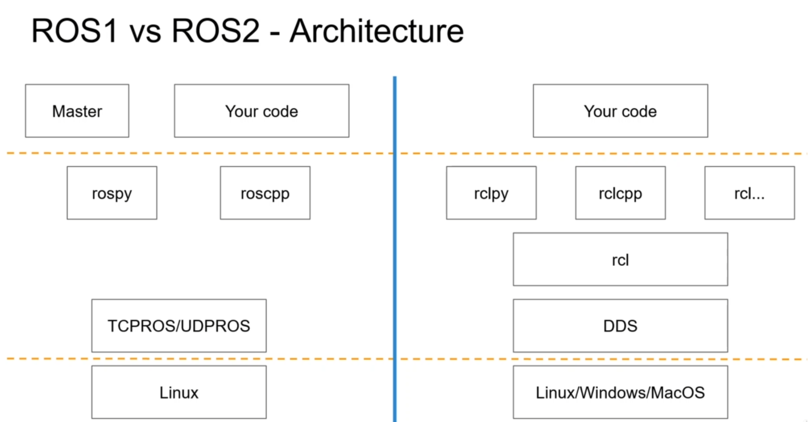

# **ROS2 Humble install**


ROS1 is close to finish and you can switch to ROS2

ROS2 structure is based on the architecture:

The main differences are:


ROS2 is a very good choice.

Interesting references for courses:
- Edouard Renard (free course): https://www.youtube.com/watch?v=Gg25GfA456o
- Edouard Renard (free youtube channel): https://www.youtube.com/@RoboticsBackEnd
- Edouard Renard: https://www.udemy.com/course/ros2-for-beginners/learn/lecture/20260476#overview
- Edouard Renard: https://www.udemy.com/course/ros2-tf-urdf-rviz-gazebo/learn/lecture/38688920#overview
- https://www.udemy.com/course/learn-ros2-as-a-ros1-developer-and-migrate-your-ros-projects/learn/lecture/22003074#overview
- https://www.udemy.com/course/ros2-ultimate-mobile-robotics-course-for-beginners-opencv/learn/lecture/28143024#overview
- https://www.udemy.com/course/ros2-self-driving-car-with-deep-learning-and-computer-vision/learn/lecture/28236852#overview

Some interesting projects:
- https://github.com/noshluk2/ROS2-Ultimate-Mobile-Robotics-Course-for-Beginners-OpenCV
- https://github.com/noshluk2/ROS2-Self-Driving-Car-AI-using-OpenCV

And the ROS2 reference sites:
- https://docs.ros.org/
- https://docs.ros.org/en/foxy/

## 1. **ROS2 Installation & Tools**
Installation could be made in a Docker image:
- https://hub.docker.com/r/osrf/ros/tags?page=1&name=humble

Open a cmd and type:
```shell
docker pull osrf/ros:humble-desktop-full
```
> Be sure you have your docker updated

For a Graphical interface and Shared folder type:
```shell
docker run --name ROS2_Humble_osrf -e DISPLAY=host.docker.internal:0.0 --mount src="C:\Users\puigm\Desktop\ROS_github\myPC_shared",dst=/home/myDocker_shared,type=bind -it osrf/ros:humble-desktop-full
```
- Open Docker Desktop

- Execute the container and Connect to it within VS Code:
    - from left-side menu choose Docker
    - right-click on the running container and select "Attach VS Code"
- Update your docker Container:
```shell
apt update
```

### **Install Gazebo**

The Ignition Gazebo is already installed, but you can install a previous version og Gazebo 11 with:
```shell
sudo apt update
sudo apt install ros-humble-gazebo-ros-pkgs
```
Open .bashrc file from root and add:
```shell
source /opt/ros/humble/setup.bash
source /usr/share/colcon_argcomplete/hook/colcon-argcomplete.bash
```
In your computer open Xlaunch

In VS Code open now Gazebo
```shell
gazebo
```

Now inside Humble container:
```shell
sudo apt update
sudo apt upgrade
sudo apt install ros-dev-tools
apt install -y git && apt install -y python3-pip
sudo apt install python3-colcon-common-extensions
```

The documentation will be found in: https://docs.ros.org/en/humble/index.html

