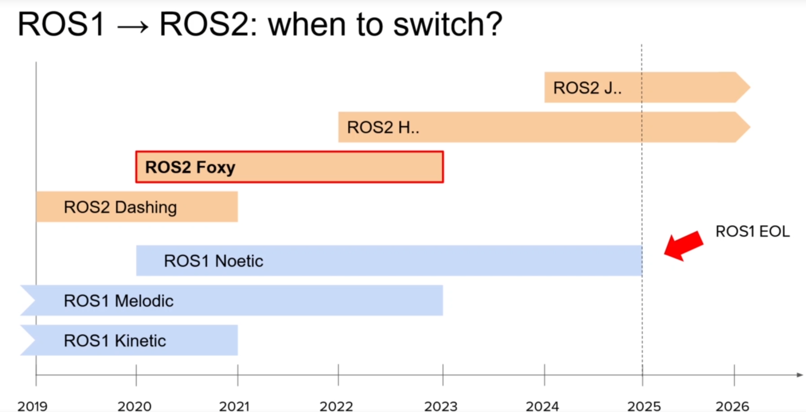
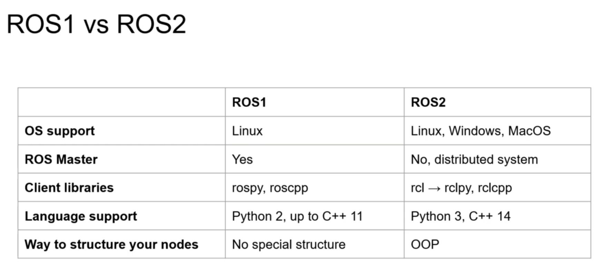
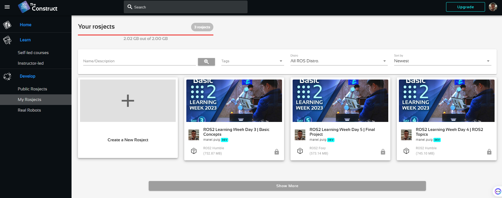
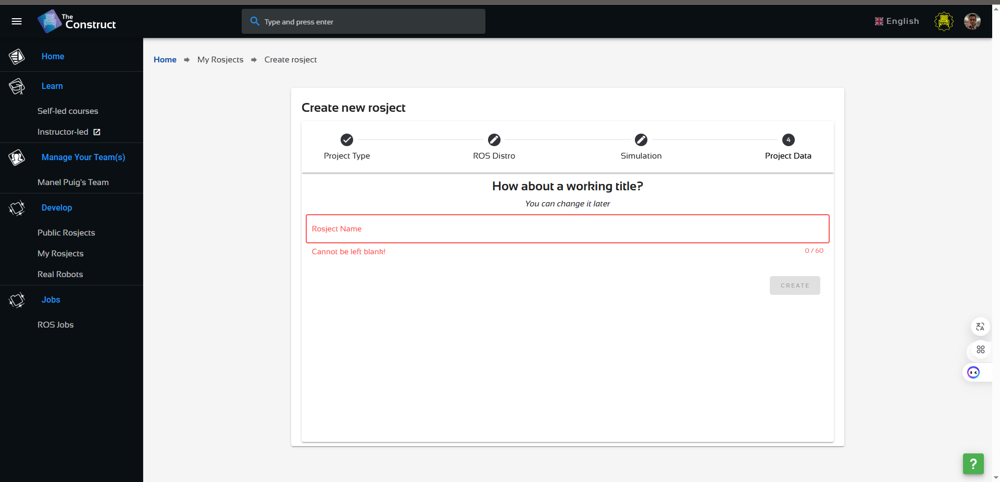

# **ROS 2 Humble: An Introduction**

In this section we will:
- learn what is ROS
- Setup a usefull working ROS environment
- Practice main concepts with Turtlesim robot

## **What is ROS?**

ROS (Robot Operating System) is not a traditional operating system, but a flexible framework for writing robot software. It's a collection of tools, libraries, and conventions that simplify the task of creating complex and robust robot behavior across a wide variety of robotic platforms.

Interesting references for courses:
- Edouard Renard: https://www.udemy.com/course/ros2-for-beginners/learn/lecture/20260476#overview
- https://www.udemy.com/course/learn-ros2-as-a-ros1-developer-and-migrate-your-ros-projects/learn/lecture/22003074#overview

And the ROS2 reference sites:
- https://docs.ros.org/
- https://docs.ros.org/en/humble/

ROS1 is close to finish and you can switch to ROS2

ROS2 structure is based on the architecture:

The main differences are:


ROS2 is a very good choice.

**The Origin of ROS**

ROS originated in 2007 at Stanford University's Stanford AI Laboratory (SAIL) as part of the Stanford Artificial Intelligence Robot (STAIR) project. Later, development transitioned to Willow Garage. ROS 2 was developed to address limitations in ROS 1, particularly concerning real-time performance, multi-robot systems, and production-level deployments. It leverages the Data Distribution Service (DDS) for its middleware.

**Why is it Useful?**

ROS 2 provides numerous benefits for robotics development:

- Hardware Abstraction: Enables code portability across different robot hardware.
- Code Reusability: Facilitates the use of existing ROS packages and libraries.
- Modularity: Encourages the development of modular and maintainable code.
- Community Support: Offers access to a large and active community.
- Production Readiness: Designed for robust and reliable deployments.
- Middleware Flexibility: DDS provides robust and scalable communication.
- Development Tools: Includes tools for visualization, debugging, and data logging (e.g., Rviz, ros2 bag).

**How it Works**

ROS 2 operates through a network of nodes that communicate using messages. Here's a basic overview:

- Nodes: Independent processes that perform specific tasks.
- Topics: Named communication channels where nodes publish and subscribe to messages.
- Messages: Data structures defined in .msg files, used to exchange information.
- DDS (Data Distribution Service): The middleware layer that handles the communication between nodes.
- Services and Actions: Mechanisms for request/response communication and long-running tasks with feedback.

## **Setup a usefull working ROS environment**

You can use the ROS environment developed by "The Construct" (https://app.theconstructsim.com/), enterprise working on ROS academia and development and located in Barcelona.
- Open the link: https://app.theconstructsim.com/
- Create a free user account
- Select "myRosjects"

- Create a New Project: Select ROS2_Humble, create from the scratch and choose a name (i.e. ROS2_Humble)

You will have 2GB Virtual machine with Ubuntu 22 and ROS2 Humble installed for free!!

**Prepare your Workspace**

Once you are in the ROS2 Humble environment, you can use our repository and make your modifications according to the exercises we will propose you.
In that case, you can follow the instructions:

- Fork the "ROS2_rUBot_tutorial_ws" repository from my github
  
- Open your ROS Noetic environment:  https://app.theconstructsim.com/
- Clone your forked directory in your home directory of container
  ```shell
  cd /home/user
  git clone https://github.com/your_username/rUBot_tutorial_ws
  cd rUBot_tutorial_ws
  catkin_make
  ```
- Open .bashrc file (from user) with VS Code (open file...)
- Ensure that you have the last 2 lines (review the exact name of your repository):

  ```xml
  source /opt/ros/noetic/setup.bash
  source /home/user/rUBot_tutorial_ws/devel/setup.bash
  ```
You are ready to work with your repository for this session!

# **3. Repository syncronisation**

The objective is to update the changes you have made, when working in ROS environment, in your github repository.

- Access to the TheConstruct environment local repository:
  ````shell
  cd /home/user/rUBot_tutorial_ws
  ````
- Update the local repository with possible changes in github origin repository
  ````shell
  git pull
  ````
- You can work with your local repository for the speciffic project session
- Once you have finished and you want to syncronize the changes you have made and update the github origin repository, type:
  ````shell
  git add .
  git commit -m "Message"
  git push
  ````
- When you will Push them, the first time you will be asked to link the repository to your github account:
- Open a terminal in and type the first time:
  ```shell
  git config --global user.email "mail@alumnes.ub.edu"
  git config --global user.name "your github username"
  ```
- for succesive times, you only need to select changes, Commit a message and Push
- You will have to specify the Username and Password (Personal Access Token you have generated)

To obtain the **PAT** in github follow the instructions:

  - Log in to GitHub
  - Go to Developer Settings
  - Select Access Personal Access Tokens: Choose Tokens (classic)
  - Click Generate new token (classic) and configure it:
    - Add a note to describe the purpose of the token, e.g., "ROS repo sync."
    - Set the expiration (e.g., 30 days, 60 days, or no expiration).
    - Under Scopes, select the permissions required:
      - For repository sync, you usually need: repo (full control of private repositories)
    - Click Generate token
  - Once the token is generated, copy it immediately. You won't be able to see it again after leaving the page.

Your github origin repository has been updated!


## **Practice ROS2 with Turtlesim**

In this section we will practice the ROS2 concepts with a very simple and useful turtlesim robot.

Documentation:
- https://docs.ros.org/en/humble/Tutorials/Beginner-CLI-Tools/Introducing-Turtlesim/Introducing-Turtlesim.html

## **Turtlesim environment**

Turtlesim is a package that contains a 2D turtle robot simulation and is a good opportunity to start working with ROS2.

We will start turtlesim node with:
```shell
ros2 run turtlesim turtlesim_node
```


We can verify the nodes:
```shell
ros2 node list
```
We will start another node to control the turtlesim robot
```shell
ros2 run turtlesim turtle_teleop_key
```
Now you will run a new node to control the turtle in the first node:
````shell
ros2 run turtlesim turtle_teleop_key
````
Use the arrow keys on your keyboard to control the turtle. It will move around the screen, using its attached “pen” to draw the path it followed so far.

You can see the nodes, and their associated topics, services, and actions:
````shell
ros2 node list
ros2 topic list
ros2 service list
ros2 action list
````
Use rqt to play with the tuertlesim robots:
````shell
rqt
````
When running rqt for the first time, the window will be blank. No worries; just select Plugins > Services > Service Caller from the menu bar at the top.
Let’s use rqt to call the /spawn service. You can guess from its name that /spawn will create another turtle in the turtlesim window.

## **Turtlesim “Catch Them All” project**

Time to start your first complete project with ROS2!

For this project you will use the Turtlesim package as a simulation tool, so you can visualize what the robot is doing.

Make sure you've watched the previous video to see what you'll get at the end of this project.