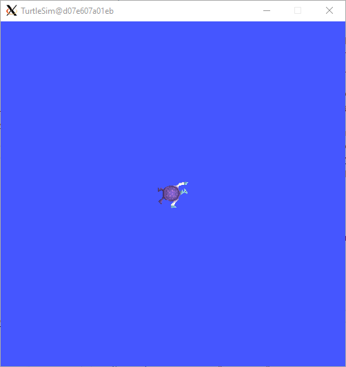

# ROS 2 Humble Hawksbill: An Introduction

## What is ROS?

ROS (Robot Operating System) is not a traditional operating system, but a flexible framework for writing robot software. It's a collection of tools, libraries, and conventions that simplify the task of creating complex and robust robot behavior across a wide variety of robotic platforms.

**Key Concepts:**

* **Nodes:** Executable processes that perform computations.
* **Topics:** Named buses over which nodes exchange messages.
* **Messages:** Data structures used for communication between nodes.
* **Services:** Request/response model for communication.
* **Actions:** Asynchronous, long-running tasks with feedback and cancellation.

**The Origin**

ROS originated in 2007 at Stanford University's Stanford AI Laboratory (SAIL) as part of the Stanford Artificial Intelligence Robot (STAIR) project. Later, development transitioned to Willow Garage. ROS 2 was developed to address limitations in ROS 1, particularly concerning real-time performance, multi-robot systems, and production-level deployments. It leverages the Data Distribution Service (DDS) for its middleware.

**Why is it Useful?**

ROS 2 provides numerous benefits for robotics development:

Hardware Abstraction: Enables code portability across different robot hardware.
Code Reusability: Facilitates the use of existing ROS packages and libraries.
Modularity: Encourages the development of modular and maintainable code.
Community Support: Offers access to a large and active community.
Production Readiness: Designed for robust and reliable deployments.
Middleware Flexibility: DDS provides robust and scalable communication.
Development Tools: Includes tools for visualization, debugging, and data logging (e.g., Rviz, ros2 bag).

**How it Works**

ROS 2 operates through a network of nodes that communicate using messages. Here's a basic overview:

- Nodes: Independent processes that perform specific tasks.
- Topics: Named communication channels where nodes publish and subscribe to messages.
- Messages: Data structures defined in .msg files, used to exchange information.
- DDS (Data Distribution Service): The middleware layer that handles the communication between nodes.
- Services and Actions: Mechanisms for request/response communication and long-running tasks with feedback.

**Example Workflow:**

- A sensor node publishes sensor data to a topic.
- A navigation node subscribes to the sensor data, processes it, and publishes control commands to another topic.
- A motor control node subscribes to the control command topic and drives the robot's motors.

# **Practice ROS2 with Turtlesim**

In this section we will practice the ROS2 concepts and different performances:
- Turtlesim environment
- Turtlesim follow-me project: https://www.udemy.com/course/ros2-for-beginners/learn/lecture/21306698?start=1#overview

Documentation:
- https://docs.ros.org/en/humble/Tutorials/Beginner-CLI-Tools/Introducing-Turtlesim/Introducing-Turtlesim.html

## **1. Turtlesim environment**

Turtlesim is a package that contains a 2D turtle robot simulation and is a good opportunity to apply what we have learnes of ROS2 in the previous chapter.

We will start with the main turtlesim node with:
```shell
ros2 run turtlesim turtlesim_node
```


We can verify the nodes:
```shell
ros2 node list
```
We will start another node to control the turtlesim robot
```shell
ros2 run turtlesim turtle_teleop_key
```
Now you will run a new node to control the turtle in the first node:
````shell
ros2 run turtlesim turtle_teleop_key
````
Use the arrow keys on your keyboard to control the turtle. It will move around the screen, using its attached “pen” to draw the path it followed so far.

You can see the nodes, and their associated topics, services, and actions:
````shell
ros2 node list
ros2 topic list
ros2 service list
ros2 action list
````
Use rqt to play with the tuertlesim robots:
````shell
rqt
````
When running rqt for the first time, the window will be blank. No worries; just select Plugins > Services > Service Caller from the menu bar at the top.
Let’s use rqt to call the /spawn service. You can guess from its name that /spawn will create another turtle in the turtlesim window.

## **Turtlesim “Catch Them All” project**

Time to start your first complete project with ROS2!

For this project you will use the Turtlesim package as a simulation tool, so you can visualize what the robot is doing.

Make sure you've watched the previous video to see what you'll get at the end of this project.